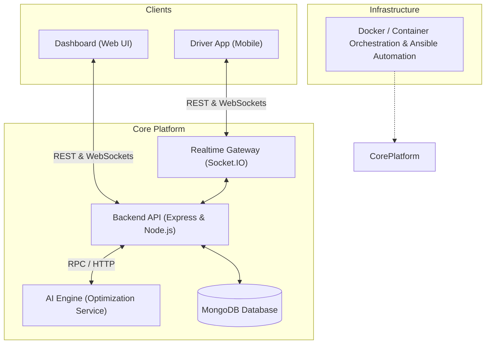

# NE-Connect AI — System Architecture

## 1. System Overview

**NE-Connect AI** is an intelligent, integrated logistics and transit coordination ecosystem engineered to connect dispatchers, drivers, and operational intelligence in real time. The platform leverages modern web services, mobile interfaces, AI-driven dispatch optimization, and real-time bidirectional communication.



---

## 2. Monorepo Modules & Responsibilities

| Module | Technology Stack | Purpose & Scope |
| :--- | :--- | :--- |
| **`backend/`** | Node.js, Express.js, Mongoose, Socket.IO | Central REST API and WebSocket hub managing authentication, business logic, persistence, and dispatch routing. |
| **`dashboard/`** | Web Client (React / Next.js) | Centralized web portal for administrative controls, real-time vehicle monitoring, dispatching, and analytical reports. |
| **`driver-app/`** | Mobile Client (React Native / Flutter) | Mobile app for field drivers to receive dispatch orders, provide telemetry/GPS tracking, and update trip milestones. |
| **`ai-engine/`** | Python / ML Services | Algorithmic routing optimization, intelligent demand forecasting, and predictive dispatch logic. |
| **`infra/`** | Docker, Ansible | Containerization definitions, deployment provisioning, and configuration management blueprints. |
| **`docs/`** | Markdown, OpenAPI / Schemas | Technical documentation, architecture blueprints, data dictionary, and integration guidelines. |

---

## 3. Core Architecture Layers (Backend)

The backend follows a clean, layered modular architecture:

```
backend/
├── src/
│   ├── config/        # Environment configurations and database connections
│   ├── controllers/   # HTTP request/response handlers
│   ├── middleware/    # Authentication, validation, and error-handling middleware
│   ├── models/        # Mongoose data schemas and entity models
│   ├── routes/        # Express route endpoint definitions
│   ├── services/      # Core business logic and external integrations
│   ├── utils/         # Helper functions, formatters, and loggers
│   └── server.js      # Application entrypoint & HTTP server bootstrap
```

---

## 4. Communication & Data Flow

1. **HTTP / REST API**:
   - Secure JSON-based endpoints for standard CRUD, session management, and queries.
   - Base health check available at `/api/health`.

2. **WebSockets (Socket.IO)**:
   - High-throughput, bi-directional event stream for live driver coordinates, trip status transitions, and emergency alerts.

3. **Data Persistence**:
   - MongoDB document database for flexible schema management across users, vehicles, trips, and logs.

---

## 5. Security & Reliability Principles

- Environment-driven configuration via `.env` with `.env.example` templates.
- Strict CORS policies for web and mobile clients.
- Isolated container deployments with unified automation pipelines.
